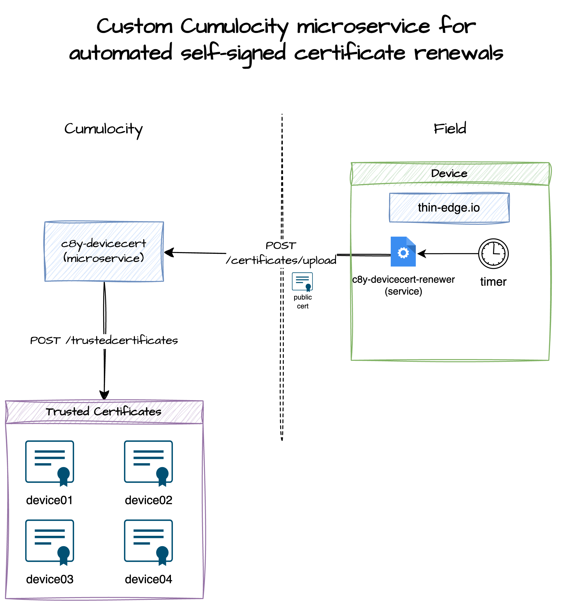

# Introduction

Cumulocity microservice to support customers who are using thin-edge.io with self signed certificates, but can't
use the new upcoming Cumulocity Certificate Authority feature.



The microservice provides one endpoint which allows for already registered devices to upload a new self-signed certificate
using a JWT obtained from the previous certificate.

* Only devices are allowed to upload a new self-signed certificate
* Device user must match the Common Name of the certificate being added
* The previous certificate is not removed (this may change in the future)

The project uses [github.com/reubenmiller/go-c8y](github.com/reubenmiller/go-c8y) which is a golang sdk for Cumulocity.

# Getting Started

## Starting the app locally

1. Clone the project

    ```sh
    git clone https://github.com/reubenmiller/c8y-devicecert.git
    cd c8y-devicecert
    ```

1. Create an application (microservice) placeholder in Cumulocity with the requiredRoles defined in the `cumulocity.devicecert.json`

    ```sh
    just register
    ```

1. Start the application

    ```sh
    just start
    ```

1. Try uploading a self-signed certificate

    ```sh
    c8y api POST "http://localhost:8080/certificates/upload" --file "$(tedge config get device.cert_path)" --force
    ```

## Build

**Pre-requisites**

* Install `jq`. Used to extract the microservice version from the cumulocity.json
* Install `zip`. Used by microservice script to create a zip file which can be uploaded to Cumulocity
* Install `docker`. Used by microservice script to create a zip file which can be uploaded to Cumulocity

Build the Cumulocity microservice zip file by executing

```sh
just build-local
```

You can then deploy the microservice using:

```sh
just deploy
```

## Deployment to Cumulocity IoT

1. Activate an already created go-c8y-cli session

    ```sh
    set-session
    ```

1. Download the microservices from the releases pages

    ```sh
    wget https://github.com/reubenmiller/c8y-devicecert/releases/download/0.0.17/devicecert_0.0.17.zip
    ```

1. Install the microservice

    ```sh
    c8y microservices create --file ./devicecert_0.0.17.zip
    ```

### Device client

A client package is available which will install systemd timer and service which will automatically renew the certificate if required (determined by the minimum validity duration). This service does not require any user interaction to renew the certificate via custom Cumulocity **devicecert** microservice.

The client package can be installed either by Cumulocity, or manually installing the package on the device and can be downloaded from the [Releases Page](https://github.com/reubenmiller/c8y-devicecert/releases).

Below shows some examples of installing it manually on the device via the command line:

**Debian / Ubuntu**

```sh
sudo apt-get install c8y-devicecert-renewer_*_all.deb

# Example
sudo apt-get install c8y-devicecert-renewer_0.0.17_all.deb
```

**RPM-based Operating Systems**

```sh
dnf install c8y-devicecert-renewer-0.0.17-1.noarch.rpm
```

#### Manually renewing the certificate

It is strongly recommended that you let the automatic certificate renewal service managed the renew of the certificate. However in the event
that you wish to manually trigger the renew, then you can run the following command on the device:

```sh
sudo systemctl start c8y-devicecert-renewer.service
```
